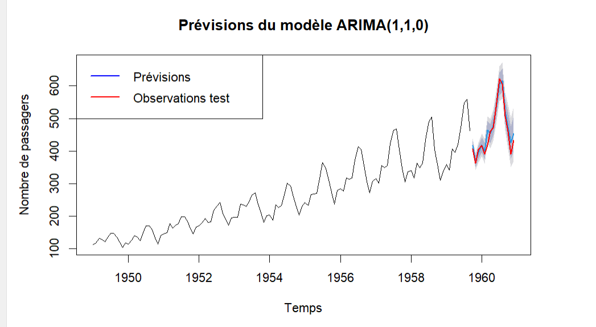

# Prévisions du nombre de passagers aérien

## Table des matières 

- [Description](#description)
- [Structure du projet](#structure)
- [Résultat & Démo](#Résultat&Démo)
- [Pré-requis](#pré-requis)

## Description


Ce projet vise à prévoir le nombre de passagers aériens mensuels à l’aide de modèles ARIMA sur la série temporelle AirPassengers. La base de données AirPassengers  est disponible sur Kaggle , c'est une série temporelle classique qui représente le nombre mensuel de passagers aériens internationaux. Elle est souvent utilisée comme exemple pour illustrer les modèles de prévision, y compris les modèles ARIMA.

Les données de la base AirPassengers contiennent les colonnes suivantes :

* Month : La date (mois et année) de chaque observation.
* Passengers : Le nombre de passagers aériens internationaux pour chaque mois.

Les données de la base AirPassengers couvrent la période de janvier 1949 à décembre 1960, soit 12 années de données mensuelles.


## Structure du projet

Notre étude suit la méthodologie de Box-Jenkins pour la modélisation ARIMA, qui se décompose en trois étapes :

1. Stationnarisation et Identification du Modèle

*Analyse des données : Examiner la série pour détecter tendances, saisonnalité et anomalies.
*Différenciation : Appliquer des transformations pour rendre la série stationnaire.
*Sélection du modèle : Utiliser les graphiques ACF et PACF pour déterminer l’ordre (p, d, q).
Estimation du Modèle

2. Estimation des paramètres : Utiliser des méthodes statistiques (moindres carrés, maximum de vraisemblance) pour estimer les paramètres du modèle ARIMA choisi.

3. Vérification et Prévision

*Diagnostic : Vérifier que les résidus sont du bruit blanc.
*Validation : Comparer les modèles via des indicateurs d’erreur (RMSE, AIC, etc.) et ajuster si nécessaire.
*Prévision : Utiliser le modèle validé pour prévoir de nouvelles périodes et comparer ces prévisions aux observations réelles.


## Résultat & Démo



Ci-dessous, vous trouverez une capture d'écran du graphique généré par notre modèle ARIMA, qui montre :

La série d’entraînement (en noir) représentant les données historiques.
Les prévisions (en bleu) produites par le modèle sur la période de test.
Les observations réelles de test (en rouge), permettant de comparer directement les prévisions aux valeurs réelles.

En résumé, le modèle ARIMA sélectionné par auto.arima() (ARIMA(1,1,0)(0,1,0)[12]) s’ajuste de manière remarquable aux données historiques et fournit des prévisions très proches des observations réelles, comme le montrent les indicateurs de performance (R² élevé, RMSE faible). Ces résultats confirment l’efficacité de notre approche pour prévoir le nombre de passagers aériens mensuels.


## Pré-requis

Avant de commencer, assurez-vous d’avoir les éléments suivants installés et configurés sur votre machine :

1. **R et RStudio** :  
   - Téléchargez et installez [R](https://cran.r-project.org/).  
   - Installez également [RStudio](https://posit.co/download/rstudio/) pour un environnement de développement intégré convivial.
  
2. **Cloner le code du markdown disponible [automatisation.R.R](automatisation.R.R) ** 

3. **Packages R nécessaires** :  

Pour mener à bien cette analyse de séries temporelles avec des modèles ARIMA, assurez-vous d’avoir installé les packages suivants :

- `forecast` : pour la modélisation, l'estimation et la prévision avec des modèles ARIMA.
- `tseries` : pour effectuer des tests de stationnarité (comme le test ADF) et d'autres analyses statistiques.
- `ggplot2` : pour la visualisation avancée des données et des prévisions.
- `readr` : pour importer et manipuler facilement les données (notamment des fichiers CSV).

   Installez-les avec la commande :
   ```R
   install.packages(c("forecast", "tseries", "ggplot2", "readr"))
